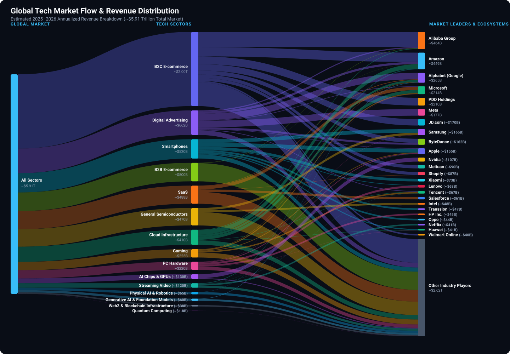

  

# 🌐 Tech-Market-Size-and-Market-Share 🚀

  
  
  

> **A comprehensive open-source database tracking global technology market sizes, industry revenue, and competitive market shares across key sectors including SaaS, Cloud Infrastructure, AI GPUs, E-commerce, and Digital Advertising.**

### 🌊 Global Tech Market Value Flow (Sankey Diagram)

  

 

### 📊 Market Size and Market Share by Tech Sector (2025–2026 Estimates) 📈

| **Sector** | **Global Market Size (Revenue)** | **Estimated GMV** | **Market Leaders & Competitors (Estimated Mean Share %)** |
| :--- | :--- | :--- | :--- |
| **SaaS** (Enterprise Applications (ERP, CRM, HCM, ITSM & Productivity)) | ~\$488 Billion | - | 1. **Microsoft** (18.0%) 2. **Salesforce** (10.0%) 3. **SAP** (5.5%) 4. **Oracle** (4.5%) 5. **Adobe** (4.0%) 6. **Intuit** (3.5%) 7. **Google (Workspace)** (3.0%) 8. **ServiceNow** (2.5%) 9. **Shopify** (2.0%) 10. **Workday** (2.0%) 11. **Atlassian** (1.2%) |
| **Generative AI & Foundation Models** (LLMs, APIs & Subscriptions) | ~\$60 Billion | - | 1. **OpenAI** (33.0%) 2. **Anthropic** (25.0%) 3. **Google (Gemini)** (18.5%) 4. **xAI (Grok)** (5.0%) 5. **DeepSeek** (4.5%) 6. **Zhipu AI** (2.5%) 7. **MiniMax** (2.0%) 8. **Moonshot AI (Kimi)** (1.5%) 9. **Mistral AI** (2.0%) 10. **ElevenLabs** (1.5%) 11. **Cohere** (1.5%) |
| **Cloud Infrastructure** (IaaS/PaaS/Hosted Cloud) | ~\$410 Billion | - | 1. **Amazon (AWS)** (29.0%) 2. **Microsoft (Azure)** (20.0%) 3. **Google Cloud** (13.0%) 4. **Alibaba Cloud** (4.0%) 5. **Oracle Cloud (OCI)** (3.0%) 6. **IBM Cloud** (2.5%) 7. **Tencent Cloud** (2.5%) 8. **Huawei Cloud** (2.5%) 9. **Baidu AI Cloud** (1.5%) 10. **CoreWeave** (1.5%) |
| **Digital Advertising** (Search, Social, Video & Retail Ads) | ~\$662 Billion | - | 1. **Meta (Facebook/Instagram)** (26.8%) 2. **Google (Alphabet)** (26.4%) 3. **Amazon Ads** (9.0%) 4. **ByteDance (TikTok/Douyin)** (7.9%) 5. **Alibaba** (4.5%) 6. **Tencent** (2.5%) 7. **Microsoft (LinkedIn/Bing)** (2.1%) 8. **Baidu** (1.8%) 9. **Apple Ads** (1.6%) 10. **Kuaishou** (1.4%) |
| **Gaming** (Software, Services & Hardware) | ~\$225 Billion | - | 1. **Tencent** (16.0%) 2. **Sony (PlayStation)** (14.5%) 3. **Microsoft (Xbox / ABK)** (12.5%) 4. **Apple (App Store Games)** (7.5%) 5. **Nintendo** (6.0%) 6. **NetEase** (5.5%) 7. **Google (Play Games)** (5.0%) 8. **Electronic Arts (EA)** (3.5%) 9. **Take-Two Interactive** (2.5%) 10. **Bandai Namco** (2.0%) 11. **Ubisoft** (1.0%) |
| **PC Hardware** (Laptops & Desktops) | ~\$220 Billion | - | 1. **Lenovo** (24.0%) 2. **HP Inc.** (20.5%) 3. **Dell** (15.5%) 4. **Apple (Mac)** (9.0%) 5. **ASUS** (7.0%) 6. **Acer** (6.5%) 7. **Samsung** (2.5%) 8. **Huawei** (2.0%) 9. **MSI** (1.5%) 10. **Microsoft (Surface)** (1.0%) |
| **Smartphones** (Hardware Devices) | ~\$520 Billion | - | *(Apple captures >45% of global smartphone industry revenues despite 20% unit volume share.)* 1. **Apple** (20.0%) 2. **Samsung** (19.0%) 3. **Xiaomi** (14.0%) 4. **Transsion** (9.0%) 5. **Oppo** (8.5%) 6. **Vivo** (7.5%) 7. **Honor** (6.0%) 8. **Huawei** (5.0%) 9. **Realme** (3.5%) 10. **Motorola / Lenovo** (3.0%) |
| **B2C E-commerce** (Retail & Consumer Goods) | ~\$2.0 Trillion | ~\$6.3 Trillion | *(Market shares represent global GMV (Gross Merchandise Value) share of ~$6.3T. Direct platform revenues differ significantly by business model (1P retail gross sales vs. 3P marketplace take-rates vs. SaaS enablers). Shopify corporate revenue (~$11B–$13B) is accounted under SaaS to prevent double counting.)* 1. **Alibaba (Taobao/Tmall)** (20.5% GMV) 2. **Amazon** (12.5% GMV) 3. **PDD Holdings (Temu/Pinduoduo)** (10.5% GMV) 4. **JD.com** (8.5% GMV) 5. **Douyin E-commerce** (5.5% GMV) 6. **Meituan** (4.5% GMV) 7. **Shopify (Merchant Ecosystem)** (4.0% GMV) 8. **Walmart Online** (2.0% GMV) 9. **Shopee (Sea Group)** (1.5% GMV) 10. **eBay** (1.2% GMV) 11. **Mercado Libre** (1.0% GMV) |
| **B2B E-commerce** (Wholesale Procurement) | ~\$500 Billion | ~\$22.0 Trillion | *(Market shares represent global B2B GMV share (~$22.0T). Highly fragmented market dominated by legacy offline enterprise contracts, EDI, and custom ERP procurement portals.)* 1. **Alibaba.com** (~1.5% GMV) 2. **W.W. Grainger** (~0.8% GMV) 3. **Amazon Business** (~0.5% GMV) 4. **Fastenal** (~0.4% GMV) 5. **Global Sources** (<0.5% GMV) 6. **Made-in-China** (<0.5% GMV) 7. **IndiaMART** (<0.5% GMV) |
| **Enterprise Networking & Telecom Equipment** (Switches, Routers, Enterprise WLAN & Telecom RAN) | ~\$215 Billion | - | 1. **Cisco** (36.0%) 2. **Huawei** (22.0%) 3. **Arista Networks** (8.5%) 4. **Nokia** (7.0%) 5. **Ericsson** (6.5%) 6. **Juniper Networks / HPE** (4.5%) 7. **ZTE** (3.5%) 8. **Extreme Networks** (1.5%) 9. **Ciena** (1.5%) |
| **Cybersecurity** (Endpoint, Identity, SASE, SIEM & Cloud Security) | ~\$210 Billion | - | 1. **Microsoft (Security)** (10.5%) 2. **Palo Alto Networks** (8.5%) 3. **CrowdStrike** (6.0%) 4. **Cisco (Security)** (5.5%) 5. **Fortinet** (5.0%) 6. **Cloudflare** (3.0%) 7. **Zscaler** (2.5%) 8. **Check Point** (2.0%) 9. **Okta** (2.0%) 10. **SentinelOne** (1.5%) 11. **Trend Micro** (1.5%) |
| **Semiconductor Capital Equipment** (Lithography, Etch, Deposition & Wafer Fab Equipment (WFE)) | ~\$135 Billion | - | 1. **ASML** (26.5%) 2. **Applied Materials** (21.5%) 3. **Lam Research** (14.5%) 4. **Tokyo Electron** (13.0%) 5. **KLA Corporation** (9.0%) 6. **Advantest** (3.5%) 7. **Teradyne** (2.5%) 8. **ASM International** (2.0%) |
| **AI Chips & GPUs** (Data Center & AI Accelerators) | ~\$130 Billion | - | 1. **Nvidia** (82.0%) 2. **AMD (Instinct)** (7.5%) 3. **Broadcom (Custom AI XPUs)** (5.0%) 4. **Cloud ASICs (TPU/Trainium/MTIA)** (3.5%) 5. **Intel (Gaudi)** (1.0%) 6. **Marvell Technology** (1.0%) |
| **General Semiconductors** (Memory, Mobile SoCs & CPUs) | ~\$470 Billion | - | 1. **Samsung Electronics** (13.0%) 2. **Intel** (10.0%) 3. **SK Hynix** (8.5%) 4. **Qualcomm** (7.5%) 5. **Broadcom** (7.0%) 6. **Micron** (5.0%) 7. **AMD (Client/Embedded)** (4.0%) 8. **MediaTek** (3.5%) 9. **Texas Instruments** (3.0%) 10. **NXP Semiconductors** (2.5%) 11. **Infineon** (2.5%) 12. **STMicroelectronics** (2.0%) 13. **Analog Devices (ADI)** (2.0%) |
| **Streaming Video** (SVOD Platforms) | ~\$120 Billion | - | 1. **Netflix** (34.0%) 2. **Disney+ / Hulu** (16.0%) 3. **Amazon Prime Video** (11.5%) 4. **Warner Bros (Max)** (9.0%) 5. **Paramount+** (4.5%) 6. **Peacock** (3.5%) 7. **Tencent Video / iQIYI** (~3.5% each) 8. **Apple TV+** (3.0%) 9. **Crunchyroll (Sony)** (1.5%) 10. **JioCinema / Hotstar** (1.2%) |
| **Physical AI & Robotics** (Embodied AI, Humanoids, AMRs & Industrial Automation) | ~\$65 Billion | - | 1. **FANUC** (13.5%) 2. **ABB Robotics** (12.0%) 3. **Intuitive Surgical** (11.5%) 4. **Midea (KUKA)** (9.0%) 5. **Yaskawa Electric** (8.5%) 6. **Amazon Robotics** (7.0%) 7. **DJI (Enterprise/Industrial)** (5.5%) 8. **Boston Dynamics / Hyundai** (3.5%) 9. **AutoStore / Symbotic** (3.0%) 10. **Unitree Robotics** (2.5%) 11. **Tesla (Optimus / FSD AI)** (2.0%) 12. **Figure AI** (1.5%) 13. **Agility Robotics** (1.0%) |
| **Quantum Computing** (Quantum Hardware, QCaaS Cloud & Algorithms) | ~\$1.8 Billion | - | 1. **IBM (IBM Quantum)** (32.0%) 2. **D-Wave Quantum** (10.5%) 3. **Quantinuum (Honeywell)** (10.0%) 4. **IonQ** (9.5%) 5. **Rigetti Computing** (6.5%) 6. **Google Quantum AI** (6.0%) 7. **Amazon Braket** (5.0%) 8. **Microsoft Azure Quantum** (4.5%) 9. **Atom Computing** (3.5%) 10. **Origin Quantum** (3.0%) 11. **QuEra Computing** (2.5%) 12. **IQM Quantum** (2.0%) 13. **Pasqal / Alice & Bob** (1.5%) |
| **Web3 & Blockchain Infrastructure** (Exchanges, Protocols & Dev Infra) | ~\$38 Billion | ~\$3.0 Trillion (Market Cap) | 1. **Binance** (44.0%) 2. **Coinbase** (12.0%) 3. **OKX** (9.0%) 4. **Bybit** (8.0%) 5. **Tether / Circle** (6.5%) 6. **L1/L2 Protocols (Ethereum/Solana fees)** (5.5%) 7. **Kraken** (3.5%) 8. **Robinhood Crypto** (2.5%) 9. **Developer Infra (Alchemy/Consensys/Chainlink)** (2.0%) |
| **Total Estimated Market** | **~\$6.470 Trillion** | **~\$31.3 Trillion** | **Combined major tech sectors listed above** |

---

### 🔎 Market Dynamics Highlights 💡
* 🤖 **The Generative AI "Bifurcation" (Consumer vs. Enterprise):** While OpenAI maintains leadership in direct consumer subscriptions (~60%+ of web AI traffic), Anthropic (Claude) has surged to capture ~32-38% of enterprise API / coding spend (as tracked by Menlo Ventures and Ramp data), closely rivaling OpenAI in business revenue. Google Gemini captures ~18.5% through enterprise Workspace & GCP integration.
* 🔬 **Semiconductor Lithography & Capital Equipment Chokepoint:** The semiconductor manufacturing foundation (~$135B WFE market) is anchored by ASML's near-monopoly on EUV/High-NA lithography systems (~26.5%), flanked by Applied Materials, Lam Research, Tokyo Electron, and KLA commanding critical etch, deposition, and metrology steps necessary for sub-2nm and HBM3e/HBM4 packaging.
* 🌐 **Enterprise Networking & AI Cluster Switching:** Enterprise networking and telecom equipment (~$215B) is led by Cisco (~36%) and Huawei (~22%), with Arista Networks (~8.5%) rapidly capturing high-margin cloud-scale 800G/1.6T AI backend switching fabrics.
* 🛡️ **Cybersecurity Platformization:** The ~$210B cybersecurity sector is rapidly consolidating around comprehensive security platforms: Microsoft Security leads (~10.5%), followed by Palo Alto Networks (~8.5%), CrowdStrike (~6.0%), Cisco Security (~5.5%), and Fortinet (~5.0%).
* 🦾 **Physical AI & Robotics Frontier:** Established industrial automation leaders (FANUC, ABB, KUKA, Yaskawa) and medical robotics (Intuitive Surgical) anchor current market revenue (~$65B), while the rapid maturation of Vision-Language-Action (VLA) foundation models has ignited commercial humanoid and warehouse logistics deployments across Tesla (Optimus), Amazon Robotics, Boston Dynamics, Figure AI, and Unitree.
* ⚛️ **Quantum Computing Inflection:** The quantum computing ecosystem (~$1.8B revenue) is dominated by cloud-accessible quantum QPUs and hybrid algorithms, led by IBM Quantum alongside specialized hardware innovators (IonQ, Quantinuum, D-Wave, Rigetti) and cloud platforms (AWS Braket, Azure Quantum, Google Quantum AI).
* 🇨🇳 **China's Frontier AI Landscape:** Beyond open-weights leader DeepSeek, China's top foundation model startups—notably Zhipu AI (GLM), MiniMax (global consumer/voice apps), and Moonshot AI (Kimi's long-context breakthroughs)—collectively command ~10-12% of the global foundation model market.
* ⛓️ **Web3 Asset Scale vs. Cash-Flow Capture:** While crypto asset market cap spans ~$3.0 Trillion with trillions in turnover, direct platform/protocol fee capture stands at ~$38 Billion, concentrated in centralized liquidity hubs (Binance, Coinbase, OKX), stablecoin reserve rails, and Layer 1/2 gas fees.
* 🎯 **Digital Advertising Realignment:** Meta and Google now each control ~26-27% of global digital advertising, with Meta surging due to AI-driven ad performance (Advantage+). Meanwhile, ByteDance (TikTok + Douyin) and Amazon Ads have expanded significantly to claim ~8% and ~9% global shares respectively.
* 🛍️ **E-Commerce GMV vs. Platform Revenue & SaaS Enablement:** Global e-commerce throughput (~$6.3T B2C GMV) is led by Alibaba (~20.5% GMV), Amazon (~12.5% GMV), and PDD/Temu (~10.5% GMV). However, direct platform revenue recognition diverges sharply: 1P retailers book gross product sales, 3P marketplaces capture ~5-15% take-rate fees, and commerce SaaS enablers (Shopify with ~$250B+ merchant GMV) monetize via subscription and fintech solutions (~$11B–$13B SaaS revenue), avoiding double-counting between merchant GMV throughput and corporate software revenue.
* ☁️ **Cloud & AI Hyperscaling:** The Cloud Infrastructure (IaaS/PaaS) "Big Three" (AWS, Azure, GCP) command ~62% of enterprise cloud spend, with Azure & GCP closing the gap on AWS via generative AI workloads.
* 💻 **PC Consolidation:** The "Big 3" (Lenovo, HP, and Dell) command ~60% of the entire PC hardware market, while Apple Mac captures ~9% volume with a significantly higher premium ASP (Average Selling Price).

---

### 🛠️ Developer Guide & Data Updates

All dataset figures are decoupled into structured JSON files located in [data/](data/).

* **To update or add new sectors:** Edit [data/market_share_2026.json](data/market_share_2026.json).
* **To regenerate README and Sankey diagram:**
  `ash
  # Python
  python scripts/generate_sankey.py --year 2026
  python scripts/generate_readme.py --year 2026

  # PowerShell (Windows native)
  .\scripts\generate_sankey.ps1 -Year 2026
  .\scripts\generate_readme.ps1 -Year 2026
  `
* For complete schema guidelines, entity mappings, and contribution rules, read the [**Developer & Contributor Guide (CONTRIBUTING.md)**](CONTRIBUTING.md).